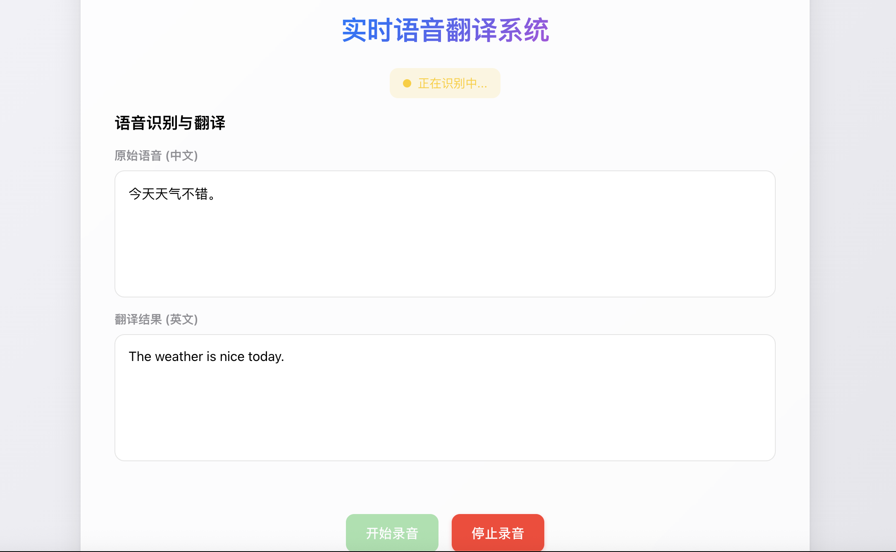

# StreamTranslation - 实时语音翻译系统

## 项目简介

StreamTranslator 是一个基于有道智云 API 的实时语音翻译应用，支持将中文语音实时转换为文字并翻译成英文。该项目使用 WebSocket 进行前后端实时通信，提供流畅的用户体验。



系统特点：
- 实时语音识别与翻译，支持流式处理
- 简洁直观的用户界面
- 基于 FastAPI 和 WebSocket 的高性能后端
- 支持语音实时输入和结果即时显示

## 技术架构

### 后端技术栈
- Python 3.6+
- FastAPI 框架
- WebSocket 实时通信
- 有道智云语音翻译 API

### 前端技术栈
- 原生 JavaScript
- WebSocket API
- Web Audio API 录音功能
- 响应式界面设计

## 系统功能

- **实时语音输入**：通过浏览器麦克风捕获用户语音
- **语音识别**：将语音转换为文本
- **实时翻译**：将识别的中文文本翻译成英文
- **字幕效果**：识别和翻译结果以滚动字幕形式显示
- **连接状态管理**：自动重连机制，确保服务的可靠性

## 运行环境要求

- Python 3.6 或更高版本
- 现代浏览器（支持 WebSocket 和 Web Audio API）
- 有道智云账号和 API 密钥

## 快速开始

### 1. 安装依赖

```bash
pip install -r requirements.txt
```

### 2. 配置 API 密钥

编辑项目根目录下的 `.env` 文件，填入您的有道智云应用 ID 和密钥：

```
APP_KEY = '您的应用ID'
APP_SECRET = '您的应用密钥'
```

> 注意：如何获取有道智云 API 密钥，请参考[有道智云开发者入门指南](https://ai.youdao.com/doc.s#guide)

### 3. 启动服务器

```bash
python app.py
```

服务启动后，通常在 http://127.0.0.1:8000 访问。

### 4. 使用系统

1. 在浏览器中打开应用
2. 点击「开始录音」按钮
3. 说话，观察实时识别和翻译结果
4. 完成后点击「停止录音」按钮

## 项目结构

```
├── app.py                # 主应用服务器
├── AuthV3Util.py         # 有道 API V3 认证工具
├── AuthV4Util.py         # 有道 API V4 认证工具
├── WebSocketUtil.py      # WebSocket 通信工具
├── .env                  # 环境配置文件
├── requirements.txt      # 项目依赖
├── index.html            # 主页面
├── styles.css            # 样式表
├── audio_recorder.js     # 音频录制模块
└── static/               # 静态资源目录
    └── main.js           # 主要前端逻辑
```

## API 说明

系统主要通过 WebSocket 与前端通信，使用以下消息类型：

- **客户端发送消息**：
  - `audio_data`：Base64 编码的音频数据
  - `is_last`：标识是否为最后一个音频包

- **服务器发送消息**：
  - `results`：中间识别和翻译结果
  - `final_results`：最终识别和翻译结果
  - `error`：错误信息
  - `connection`：连接状态通知

## 自定义配置

### 修改源语言和目标语言

在实例化 `TranslationSession` 类时，可以指定 `lang_from` 和 `lang_to` 参数：

```python
session = TranslationSession(
    client_id='user_id',
    lang_from='zh-CHS',  # 中文
    lang_to='en'         # 英文
)
```

支持的语言代码请参考[有道智云文档](https://ai.youdao.com/)

## 部署建议

- 生产环境建议使用 HTTPS，以确保麦克风访问权限
- 考虑使用 Nginx 或其他反向代理服务器
- 处理音频数据的高并发需求
- 实现用户认证和授权机制

## 常见问题

1. **无法连接到 WebSocket 服务器**
   - 检查服务器是否正常运行
   - 确认浏览器支持 WebSocket
   - 检查网络连接和防火墙设置

2. **麦克风无法使用**
   - 确保已在浏览器中授予麦克风访问权限
   - 检查系统麦克风设置
   - 某些浏览器可能需要 HTTPS 才能访问麦克风

3. **翻译结果不理想**
   - 检查麦克风质量和环境噪音
   - 尝试更清晰地发音
   - 可能受限于有道智云 API 的翻译质量

## 许可证

本项目采用 MIT 许可证。详情请参阅 [LICENSE](LICENSE) 文件。

## 贡献指南

欢迎提交 Issue 和 Pull Request 来改进本项目。在提交 PR 之前，请确保：

1. 代码符合项目的编码风格
2. 已添加必要的测试和文档
3. 所有测试都通过

## 致谢

- [有道智云](https://ai.youdao.com/) - 提供语音翻译 API
- [FastAPI](https://fastapi.tiangolo.com/) - 高性能的 Python Web 框架
- 所有贡献者和使用者